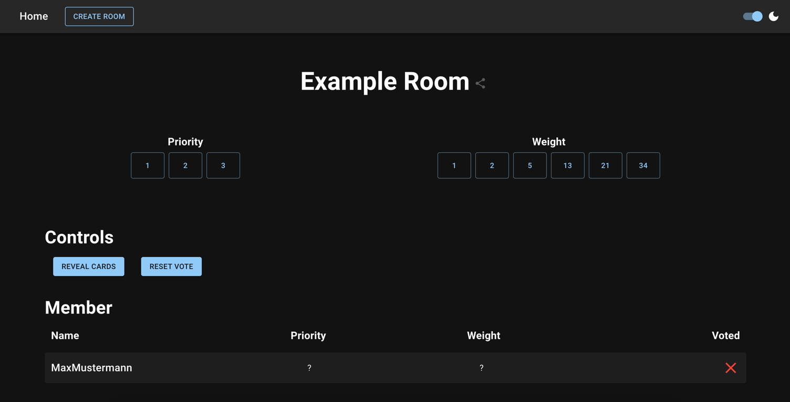

# Planning Poker

## Description
A simple application to play planning poker with your team.  
The application is build with React and uses Node.js as a backend.

## Features
- Configurable priorities and weights
- Multiplayer, of course :)
- Kick players, the "back in a minute" ones
- Dark-Mode
- Binary download (linux, macos, windows)
- Container images (amd64 & arm64)
- No database required

## Example images
### Start page

### Create a new room

### Player options

### Room overview


## Table of Contents

- [Description](#description)
- [Example images](#example-images)
- [Table of Contents](#table-of-contents)
- [Installation](#installation)
- [Usage](#usage)
- [Contributing](#contributing)

## Installation
There are several ways to install the application.

### Source
You can clone the repository and build the application yourself.
```bash
git clone https://github.com/PaDreyer/planning-poker.git
cd planning-poker
yarn install
yarn build
```
After that you can start the application with the following command:
```bash
yarn start
```

### Node.js
You can also download the bundled application code from the [release page](https://github.com/PaDreyer/planning-poker/releases).  
After unzip you can start the application with the following command:
```bash
node bundle.js
```
**Note**: The public folder is required to run the application. It has to be in the same directory as the bundle.js file.

### Docker
The easiest way to install the application is to use docker.
You can download the image from GitHub Container Registry.
```bash
docker pull ghcr.io/padreyer/planning-poker:latest
```
After that you can start the container with the following command.
```bash
docker run -p 8080:8080 -e PORT=8080 ghcr.io/padreyer/planning-poker:latest
```

### Binary
You can also download the binary from the [release page](https://github.com/PaDreyer/planning-poker/releases).
After that you can start the application with the following command:
```bash
./planning-poker-OS-ARCH
```

**Note**: Some binaries may require to be signed before you can execute them.  

On macOS, you can sign the binary with the following command:
```bash
codesign --sign - ./planning-poker-macos-arm64
```

## Usage
You can configure the application with the following environment variables.

PORT: The port on which the application should listen. Default: 8080  

After starting your application, either with docker or the binary, you can open the application in your browser.
The application is listening on port 8080 by default.

## Development
You can start the application in development mode with the following command:
```bash
yarn dev
```
Afterward your application is listening on port 3000 and you can open it in your browser.


## Contributing
Contributions are welcome. For major changes, please open an issue first to discuss what you would like to change.

Please make sure to update tests as appropriate.

## License
[MIT](https://choosealicense.com/licenses/mit/)