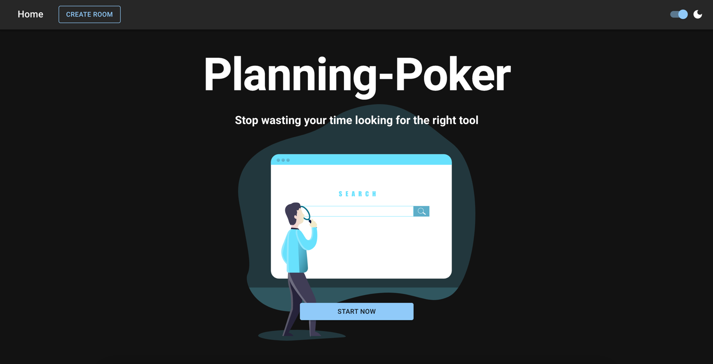
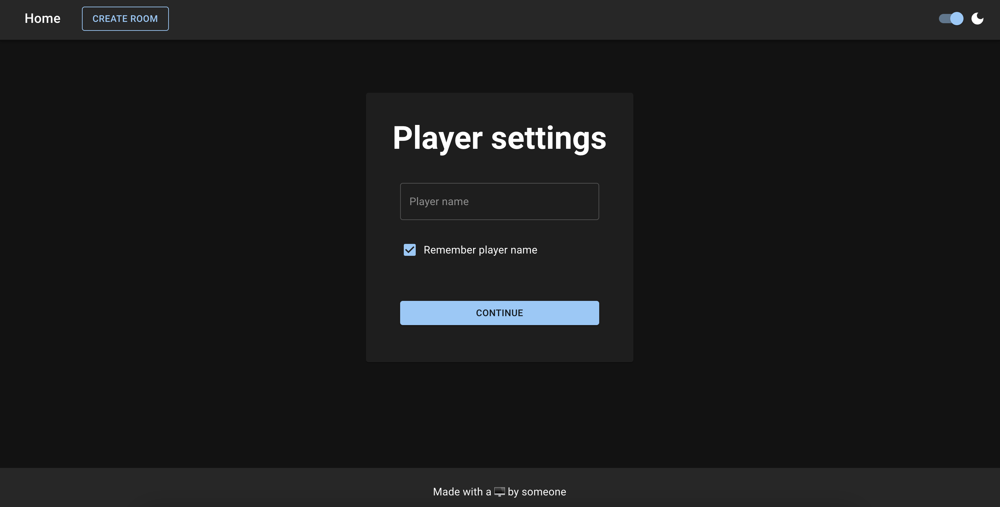

# Planning Poker

## Description
A simple application to play planning poker with your team. 
The application is build with React and uses NodeJS as a backend.

## Example images
### Start page

### Create a new room

### Player options

### Room overview

### Room voting


## Table of Contents

- [Description](#description)
- [Example images](#example-images)
- [Table of Contents](#table-of-contents)
- [Installation](#installation)
- [Usage](#usage)
- [Contributing](#contributing)

## Installation
There are several ways to install the application.

### Docker
The easiest way to install the application is to use docker.
You can download the image from GitHub Container Registry.
```bash
docker pull ghcr.io/padreyer/planning-poker:latest
```
After that you can start the container with the following command.
```bash
docker run -p 8080:8080 ghcr.io/padreyer/planning-poker:latest
```

### Binary
You can also download the binary from the release page.
After that you can start the application with the following command.
```bash
./planning-poker-OS-ARCH
```

## Usage
You can configure the application with the following environment variables.

PORT: The port on which the application should listen. Default: 8080

## Development
You can start the application in development mode with the following command:
```bash
yarn dev
```
Afterward your application is listening on port 3000.


## Contributing
Contributions are welcome. For major changes, please open an issue first to discuss what you would like to change.

Please make sure to update tests as appropriate.

## License
[MIT](https://choosealicense.com/licenses/mit/)